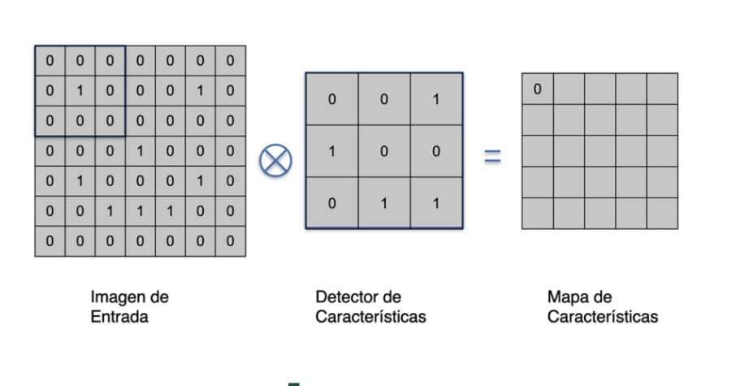
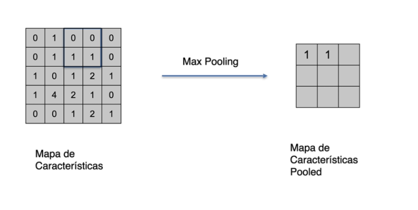
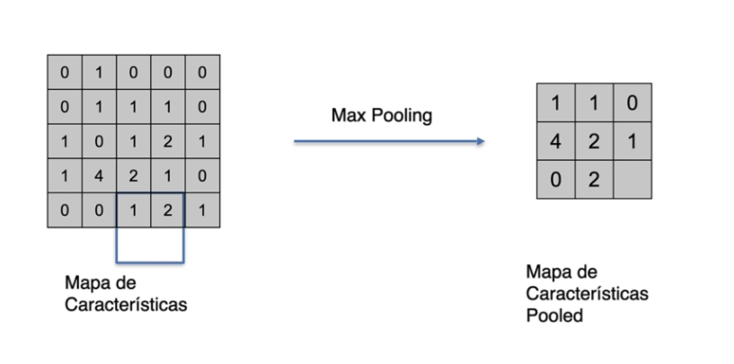
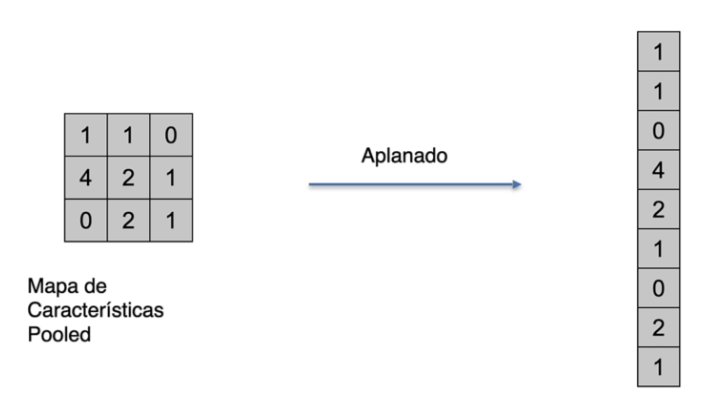
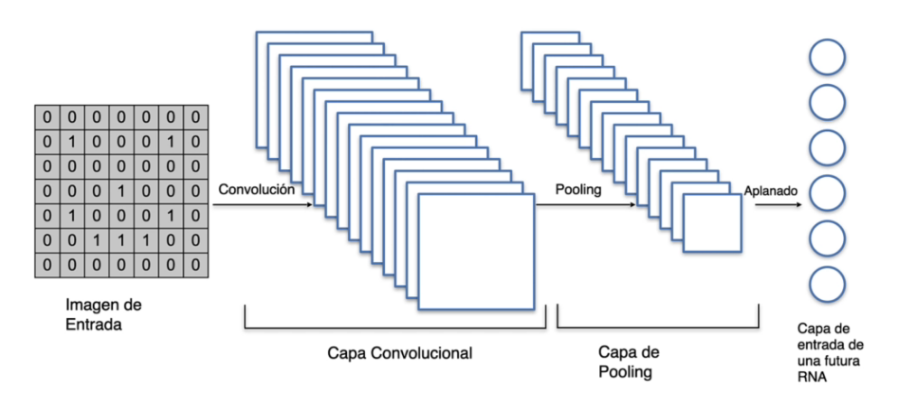
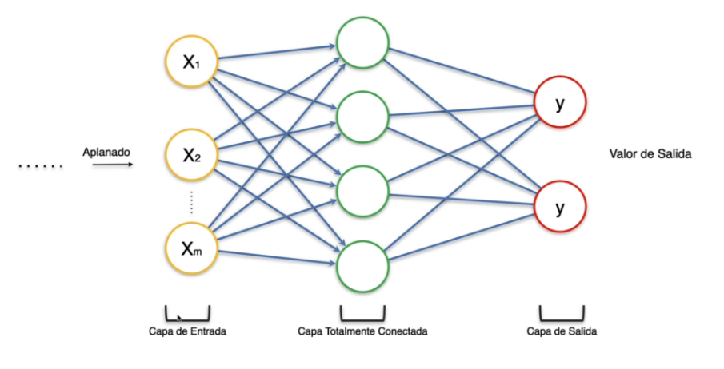
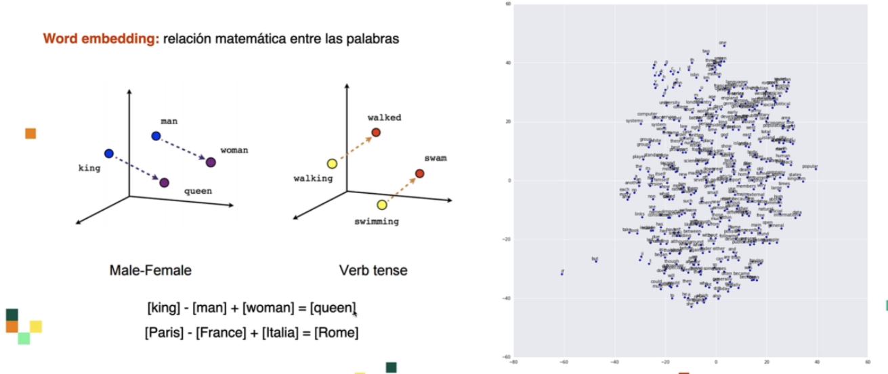

# Index

# Introduccion
Parte de la inteligencia artificial que trata de entender el lenguaje humano, es algo bastante complejo porque el ordenador trabaja con ceros y unos<br />

# CNN 
Nos ayudan a resolver toda la parte de clasificacion, analisis empocional en base al texto, etc..<br />
<br/>
NO ES MULIPLICACION DE MATRICES, multiplicamos valor por valor y los sumamos<br />
El detector de caracteristicas busca en base a la convencion que le pasemos, por ejemplo, si ponemos una X buscaria solo 8 porque es el unico numero que cumple esta condicion<br />
```sh
1 0 1
0 1 0
1 0 1
```
La red neuronal va a ir modificando la convencion que le vayamos pasando e ir ajustandola en base a los valores generados<br />

## Max Pooling
Vamos agregando el valor maximo dentro de la imagen<br />
<br/>
<br/>

## Flatten
<br/>

## Funcionalidad final
<br/>
<br/>

## Texto
<br/>
Se debe analizar para cada palabra en que contexto aparece, antes y despues de cada palabra. Se elige una ventana a la palabra que queremos analizar, por ejemplo, si elegimos una ventana 2, se eligen las 2 palabras antes y despues para analizar.<br />
Si tuvieramos la palabra 

**In spite of everything, I still believe people are really good at heart**
 y usamiarmos la palabra **goog** con un nivel 2, tomariamos las siguiented duplas<br />
```py
("good", "are")  ("good", "really")
("good", "at")   ("good", "heart")
```
